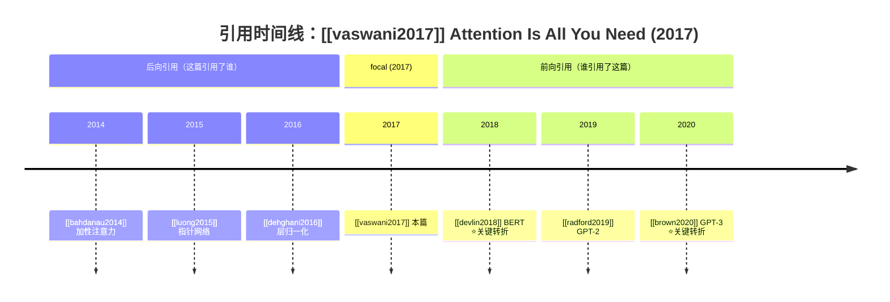
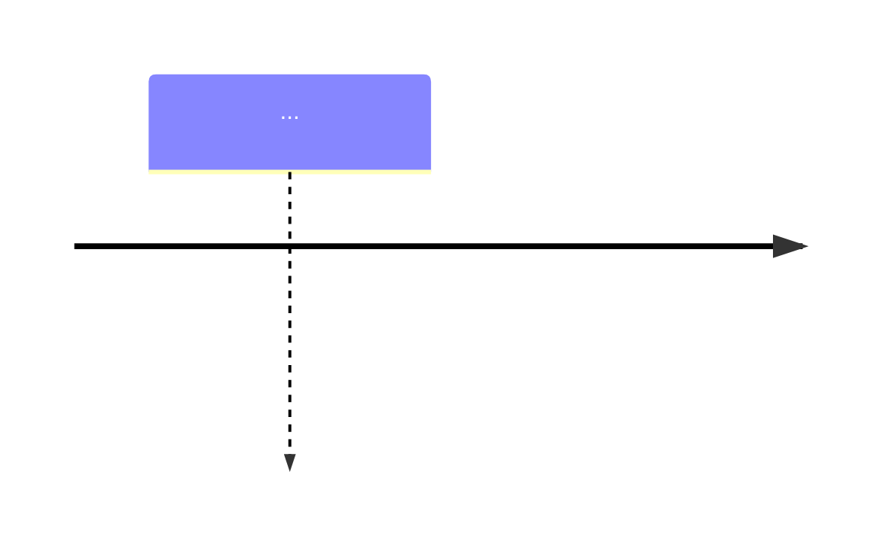

# Building Citation Timeline

## Purpose

This skill is the **paper-centered citation-graph builder** of the academic
PKM workflow. Given one focal paper, it answers two mirror questions on a
single timeline:

- **谁引用了这篇** (forward citations) — the paper's intellectual *children*.
- **这篇引用了谁** (backward references) — the paper's intellectual *parents*.

Unlike `tracing-lineage-by-era` (topic-centric, time-sliced across many
authors) or `tracing-lineage-by-team` (author-centric across whatever topics
one lab touched), this skill is **paper-centric and bidirectional**: the
focal paper is the spine, and the timeline radiates outward in both
directions along the *citation* axis, not the *topic* or *author* axis.

The deliverable is an interactive Mermaid timeline note the user can revisit
during spaced review, with high-influence papers flagged so the user can see
at a glance which citing/cited work actually redirected the field.

## Core Principle

**Citation edges come from the Semantic Scholar citation graph, not from the
model's parametric memory.** A "Paper A cited Paper B" claim is only
trustworthy when S2's `/citations` or `/references` endpoint returns it
directly. Therefore:

1. Every paper on the timeline — forward or backward — comes from
   `resources/citation_graph.py`, which calls S2's citation endpoints. The
   model never invents a citing or cited paper.
2. Because the edges are API-sourced, the "A cited B" relationship is
   verified *by construction* — this skill does NOT need to route every edge
   through `fact-checking-citations` the way lineage skills do (see
   Cross-Skill Dependencies). Anti-hallucination here is lighter: it guards
   against fabricating the *narrative annotation*, not the citation edges.
3. "Key turning point" labels are grounded in `influentialCitationCount`
   (an S2-computed field), not in the model's opinion. The model may add a
   one-sentence gloss, but the flag itself is data-driven.

## Input

- **Required**: a focal paper identifier, given as one of:
  - A **citekey** the user uses in their vault (e.g., `vaswani2017`).
    Resolved to a DOI via local `_index.csv` / `_ccf_a.bib` first; falls
    back to the Zotero local API (`http://localhost:23119`) if not local.
  - A **DOI** (e.g., `10.5555/3295222.3295349`). Prefixed as `DOI:...`
    before being passed to the script.
  - An **arXiv id** (e.g., `1706.03762`). Prefixed as `ArXiv:...`.
- **Optional**:
  - `--depth` : 1 (default) = only the focal paper's direct forward +
    backward citations. 2 = additionally expand the top-K most-cited papers
    one more hop. Depth 2 costs many more S2 requests and is far more likely
    to hit rate limits; only use when the user explicitly asks for a
    "二跳" / two-hop graph.
  - `--limit` : per-direction cap (default 500, hard cap 1000).
  - Output format hint: `mermaid` (default) or `table` (fallback when the
    timeline would exceed ~40 nodes).
  - `直接写入` / `auto-write`: skip the confirmation step and write the
    note immediately.

### Citekey → paper_id resolution

1. If the input looks like a DOI (`10.\d+/...`) or already carries a prefix
   (`DOI:`/`ArXiv:`), pass it through to the script verbatim.
2. If the input is a bare citekey, look it up in `d:\Desktop\论文\_index.csv`
   (column `doi`) → if found, use `DOI:{doi}`. Else query `_ccf_a.bib` →
   `DOI:{doi}`. Else query the Zotero local API by citekey.
3. If no DOI/arXiv id can be resolved, **stop** and ask the user to supply a
   DOI directly. Do not guess a paper from the citekey string.

## Pipeline

### Step 1 — Pull the citation graph from Semantic Scholar

Call the script owned by this skill:

```
python d:\Desktop\论文\.trae\skills\building-citation-timeline\resources\citation_graph.py \
    "DOI:10.5555/3295222.3295349" --depth 1 --limit 500
```

The script calls, in order:
- S2 `/paper/{id}` → focal paper metadata (title/year/authors/citationCount/
  influentialCitationCount/externalIds/abstract/tldr).
- S2 `/paper/{id}/citations` → forward citations (who cited this). Each
  result is under the `citingPaper` field.
- S2 `/paper/{id}/references` → backward references (what this cited). Each
  result is under the `citedPaper` field.

Requested nested-paper fields: `title, year, authors, citationCount,
influentialCitationCount, externalIds, venue`. The script handles 429
rate-limiting with exponential backoff and honors the `S2_API_KEY`
environment variable. See
[`resources/citation_graph.py`](resources/citation_graph.py).

The script returns a JSON object with this shape (abbreviated):

```json
{
  "focalPaper": { "paperId": "...", "title": "...", "year": 2017, "doi": "...", ... },
  "forwardCitations": {
    "total": 12000, "yearRange": [2017, 2024],
    "byYear": { "2017": [...], "2018": [...], ... },
    "yearCounts": [ {"year": 2017, "count": 3}, ... ],
    "keyTurningPoints": [ {"title": "...", "influentialCitationCount": 85, ...} ]
  },
  "backwardReferences": { "...same shape..." },
  "depth": 1, "degraded": false
}
```

Capture this JSON in memory for Steps 2–4.

### Step 2 — Aggregate forward and backward citations by year

This aggregation is **already performed by the script** (`aggregate_by_year`
in `citation_graph.py`). The skill's job here is to *consume* it and prepare
two year-indexed series:

- **Forward series** (谁引用了这篇): from `forwardCitations.byYear`. Each
  year bucket holds the papers that cited the focal paper that year. This
  shows the focal paper's *downstream* impact trajectory.
- **Backward series** (这篇引用了谁): from `backwardReferences.byYear`.
  Each year bucket holds the papers the focal paper cited, grouped by *the
  cited paper's* publication year. This shows the focal paper's *upstream*
  intellectual roots.

For the timeline, merge the two series onto a single year axis. The focal
paper's own year is the anchor point; forward citations lie to the right
(later years), backward references lie to the left (earlier years). Years
with zero papers in either direction are skipped (not rendered as empty
slots) to keep the timeline compact.

### Step 3 — Generate the interactive Mermaid timeline

Render the merged series as a Mermaid `timeline` block so it renders inline
in Obsidian. Two `section`s per direction, or two timelines back-to-back —
the latter is preferred for legibility:



Rules:
- Every paper appears as `[[citekey]]` (wikilink). The focal paper is always
  rendered in its own `section focal (YYYY)` slot so the user sees the
  anchor.
- Each entry may carry a one-sentence gloss distilled from the paper's
  `tldr` / title — never from parametric memory. If no `tldr` exists, show
  the title only.
- Key turning points (Step 4) are suffixed with a `⭐关键转折` marker.
- Cap: ~40 nodes total (forward + backward). When the focal paper is
  massively cited (e.g., >1000 forward citations), show only the top
  `influentialCitationCount` papers per year plus the key turning points;
  list the full per-year counts in a Markdown table beneath the timeline so
  no information is silently lost.
- If the Mermaid block would exceed ~40 nodes, auto-switch to the Markdown
  table format (same as `tracing-lineage-by-era`'s fallback).

### Step 4 — Annotate "key turning point" papers

The script already flags candidates in `keyTurningPoints` (papers where
`influentialCitationCount` is in the top-10 of that direction, or ≥ 10).
The skill's job is to **present** them with annotation:

1. Take `forwardCitations.keyTurningPoints` and
   `backwardReferences.keyTurningPoints` from the script output.
2. For each, render it on the timeline with the `⭐关键转折` marker (Step 3).
3. Append a dedicated `## 关键转折论文` section to the note listing each
   flagged paper with: citekey, DOI, year, `influentialCitationCount`,
   `citationCount`, and a one-sentence gloss from its `tldr`/title.
4. The model MAY add a one-sentence "为什么是转折" hypothesis, but it MUST
   be prefixed with "疑似" and grounded in the paper's title/tldr — never a
   free-form claim. If the title/tldr does not support a gloss, leave the
   gloss blank rather than invent one.

The distinction between `citationCount` (raw count) and
`influentialCitationCount` (S2's measure of citations that actually
influenced the citing work) MUST be stated in the note so the user
understands why a lower-citation paper can still be a "key turning point".

### Step 5 — Write to the Obsidian vault

Write the timeline note to:

```
d:\Desktop\论文\obsidian-vault\Reviews\{citekey}-timeline.md
```

where `{citekey}` is the focal paper's citekey (lowercased, no spaces).
Create the `Reviews/` folder if it does not exist.

Note structure:

```markdown
---
type: review
timeline: citation
focal: vaswani2017
doi: 10.5555/3295222.3295349
year: 2017
generated: 2026-07-21
dataSource: semantic_scholar
depth: 1
degraded: false
---

# 引用时间线：Attention Is All You Need

## 概览
- focal：[[vaswani2017]] (2017, citationCount=130000, influentialCitationCount=...)
- 前向引用（谁引用了这篇）：12000 篇，年份范围 2017–2024
- 后向引用（这篇引用了谁）：28 篇，年份范围 1990–2017
- 关键转折论文：8 篇（前向 6，后向 2）

## 引用时间线


## 关键转折论文
| citekey | DOI | 年份 | influCite | citeCount | 疑似转折原因 |
|---------|-----|------|-----------|-----------|-------------|
| [[devlin2018]] | 10.18653/v1/N19-1423 | 2018 | 85 | 70000 | 疑似：将 Transformer 预训练用于双向语言模型 |

## 年度引用量
| 年份 | 前向(被引) | 后向(引用) |
|------|-----------|-----------|
| 2014 | 0 | 2 |
| 2017 | 3 | 5 |
| 2018 | 120 | 0 |
| ... | | |

## 引用反查记录
（引用关系由 S2 citation graph 直接返回，无需额外反查；DOI 真实性依赖 S2 数据库。）
```

Write protocol:
1. If the file already exists: **preserve the frontmatter and any
   `> [!user-note]` callouts**, replace only the timeline/table and the
   `## 关键转折论文` / `## 年度引用量` sections. Never overwrite
   user-authored prose outside callouts.
2. The `## 引用反查记录` section records that edges are API-sourced (see
   Anti-Hallucination); it is not a placeholder for `fact-checking-citations`
   the way it is in the lineage skills.
3. Confirm the exact path, node count, and key-turning-point count to the
   user after writing.

## Anti-Hallucination

This skill's anti-hallucination posture is **lighter than the lineage
skills**, because the citation edges themselves are API-sourced and thus
verified by construction. The guardrails target the *annotation layer*, not
the edge layer:

### A1. Edges are never fabricated

Every "A cited B" or "B cited A" relationship on the timeline MUST come
from the script's JSON output (`forwardCitations` / `backwardReferences`).
The model never adds a paper to the timeline from parametric memory. If the
user asks "why isn't X on the timeline?", the answer is "X is not in S2's
citation graph for this focal paper" — not a guess.

### A2. Citekey + DOI on every paper mention

Same rule as the lineage skills: any paper on the timeline or in the tables
MUST appear as `[[citekey]]` AND carry its DOI (inline or in a table).
- `citekey` source: local `_index.csv` `id` field, or `_ccf_a.bib`. Papers
  that come only from S2 (no local row) get a synthesized citekey
  `firstauthor{year}` and are flagged `citekey=合成` in a footnote so the
  user knows it is not yet in their BibTeX.

### A3. Key-turning-point flags are data-driven

The `⭐关键转折` marker is applied **only** to papers the script flagged in
`keyTurningPoints` (i.e., high `influentialCitationCount`). The model may
not promote a paper to "key turning point" based on its own judgment, and
may not demote a flagged paper without stating why.

### A4. Glosses are grounded

Any one-sentence gloss next to a timeline entry or in the
`## 关键转折论文` table MUST be traceable to that paper's `tldr` or `title`
field from the script output. If neither supports a gloss, leave it blank.
"疑似" glosses (Step 4.4) follow the same grounding rule.

### A5. No fact-checking-citations routing (by design)

Per the `fact-checking-citations` skill's own dependency table, this skill
does **not** route its edges through fact-checking — the edges come from S2's
citation graph directly. Only if the user explicitly asks to verify a DOI's
existence (e.g., a suspicious synthesized citekey) does this skill hand a
single DOI to `fact-checking-citations`. This is an intentional exception,
documented in the note's `## 引用反查记录` section.

## Failure Strategies

### F1. S2 rate limit (primary failure mode) — reduce depth

`citation_graph.py` retries 429 with exponential backoff
(1s→2s→4s→8s→16s, up to 5 attempts). When the script exhausts retries it
returns a partial/empty graph and sets `degraded: true` in the JSON (and
exits with code 2). The skill reacts by **reducing depth**:

1. If the failing run was `--depth 2`: re-run with `--depth 1`. Depth 2
   issues 2 + 4*expand_top requests; depth 1 issues only 3 requests
   (focal + citations + references), so it almost always succeeds even
   under throttling.
2. If the failing run was already `--depth 1`: reduce `--limit` (e.g.,
   500 → 200 → 100) and retry. Fewer per-direction papers means fewer pages
   and less exposure to 429s.
3. If even `--depth 1 --limit 100` fails: write the note with whatever
   partial data the script returned, and prepend a prominent banner:

   ```
   > [!warning] S2 限速降级
   > 本次引用时间线仅含部分数据（前向 N 篇 / 后向 M 篇）。
   > 建议配置 S2_API_KEY 后重跑以获得完整图谱。
   ```

   The banner is mandatory; silent partial writes are forbidden.
4. A1–A4 still apply in full to whatever partial data is written.

### F2. Focal paper not found

- The script returns `error: "FOCAL_PAPER_NOT_FOUND"` (exit code 1) when
  S2 returns 404 for the paper id. The skill MUST stop and tell the user:
  the DOI/citekey did not resolve to a paper in S2. Suggest verifying the
  DOI via `fact-checking-citations` or supplying an arXiv id instead.
- Do NOT fall back to a title search and pick a "likely" paper. A citation
  timeline built on the wrong focal paper is worse than no timeline.

### F3. Citekey unresolvable

If the input is a bare citekey and no DOI/arXiv id can be found in
`_index.csv`, `_ccf_a.bib`, or the Zotero local API: stop and ask the user
to supply a DOI directly. Do not guess a paper from the citekey string
(e.g., do not assume `smith2020` maps to a specific paper).

### F4. Timeline too large

- Forward citations can number in the tens of thousands for seminal papers.
  The script caps per-direction at `--limit` (default 500). Even so, 500
  nodes cannot all appear on a Mermaid timeline.
- When total nodes (forward + backward) exceed ~40: render only (a) all
  backward references (usually few), (b) the key turning points, and (c)
  the top-`influentialCitationCount` paper per year. Put the full per-year
  counts in a `## 年度引用量` table so the magnitude is still visible.
- When even the table is large (>100 rows), aggregate to 2-year or 5-year
  buckets in the table and note the bucketing.

### F5. Network / script errors

- `requests` not installed: print `pip install requests` and abort.
- `citation_graph.py` not found: print the expected absolute path and abort.
- S2 `/paper/{id}` returns 500/503: retry once after 10s; if still failing,
  treat as F1 (degraded write with banner).

## Cross-Skill Dependencies

- `d:\Desktop\论文\.trae\skills\building-citation-timeline\resources\citation_graph.py`
  — owned by this skill; Step 1 data source. Calls S2 `/paper/{id}/citations`
  and `/paper/{id}/references`.
- `d:\Desktop\论文\_index.csv`
  — local paper index; citekey → DOI resolution (Input section) and the
  source of real citekeys. Read-only.
- `d:\Desktop\论文\_ccf_a.bib`
  — BibTeX fallback for citekey → DOI resolution. Read-only.
- `d:\Desktop\论文\obsidian-vault\Reviews\`
  — write target for Step 5. Created on demand.
- `d:\Desktop\论文\.trae\skills\fact-checking-citations\`
  — NOT a blocking dependency (see A5). Invoked only on explicit user
  request to verify a suspicious DOI.

This skill does **not** call `tracing-lineage-by-era` (topic-centric era
narrative), `tracing-lineage-by-team` (author-centric), or
`synthesizing-literature-review` (cross-cutting synthesis). If the user asks
"这个领域怎么演进的", route to `tracing-lineage-by-era`. If they ask "谁引用
了这篇 / 这篇引用了谁", route here.

## Interaction Contract

1. **Acknowledge**: echo the resolved focal paper (citekey + DOI + title +
   year + citationCount) so the user can confirm the right paper was picked
   up before the (rate-limit-sensitive) S2 pull.
2. **State the plan**: report intended `--depth` and `--limit`, and warn if
   depth 2 will be expensive.
3. **Report data-source status**: before showing results, state whether the
   script succeeded or degraded (e.g., "S2 拉取前向 847 篇 / 后向 28 篇，
   限速降级=false").
4. **Show the timeline** for review, plus the `## 关键转折论文` table.
5. **Ask before writing** unless `直接写入` was given. Confirm path:
   `obsidian-vault\Reviews\{citekey}-timeline.md`.
6. **Write & confirm**: report the exact file path, node count, key-turning-
   point count, and whether the run was degraded.

## Constraints

- This skill operates on **one focal paper at a time**. If the user asks for
  multiple papers, run sequentially.
- This skill is **bidirectional around one paper**, not a topic narrative.
  Route era/topic questions to `tracing-lineage-by-era` (see negative
  condition in the frontmatter).
- The Mermaid timeline is capped at ~40 nodes; beyond that, auto-switch to
  the Markdown table format with a compact timeline summary on top.
- Depth 2 is opt-in and rate-limit-fragile; the skill always starts at
  depth 1 unless the user explicitly asks for two-hop expansion.
- `influentialCitationCount` is S2's measure, not a qualitative judgment.
  The note must state this so the user does not read "key turning point" as
  an editorial verdict.
- All file writes target `obsidian-vault\Reviews\{citekey}-timeline.md`
  only. This skill never touches `Literature/@citekey.md` notes, MOC files,
  or `_index.csv` (read-only).
- The skill must state its limitations in every output note: "引用关系基于
  Semantic Scholar citation graph，受 S2 覆盖度与限速影响；关键转折标注依赖
  influentialCitationCount 指标，非编辑性判断。"
