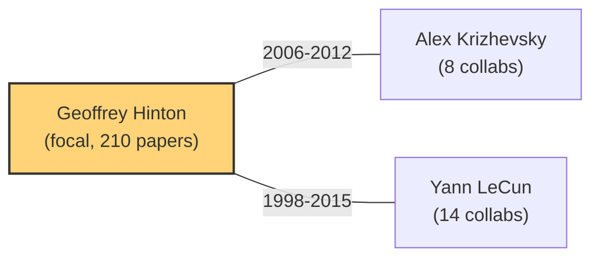
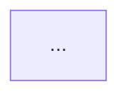

# Tracing Lineage By Team

## Purpose

This skill is the **team-centered lineage tracer** of the academic PKM
workflow. Given an author name or a team identifier, it reconstructs that
team's research trajectory: what they worked on, when they pivoted, and who
collaborated with whom along the way.

Unlike `tracing-lineage-by-era`, which follows a *topic* through time across
many authors, this skill follows *one team* through time across whatever
topics they touched. The unit of analysis is the author/lab, not the theme.

## Core Principle

**The team is the spine; papers are vertebrae.** Every claim in the lineage
narrative must be anchored to a real, retrievable paper. The skill does not
invent papers, invent collaborations, or invent pivots — it only surfaces
patterns that the data already supports. All citations produced by this skill
MUST route through `fact-checking-citations` before the output note is
finalized.

## Input

- **Required**: an author name or team identifier.
  - Personal name examples: `"Hinton"`, `"Geoffrey Hinton"`,
    `"Yann LeCun"`.
  - Team/lab identifier examples: `"DeepMind"`, `"OpenAI"`,
    `"Stanford NLP"`. Team identifiers are matched against the `affiliations`
    field returned by S2 `/author/search` and the local `_index.csv`.
- **Optional**: a year range filter (e.g., `2006-2024`) to bound the lineage.

### Resolution path (team identifier → author set)

1. If the input is a personal name → call
   `resources/author_cluster.py "Name"` directly. S2 `/author/search` returns
   candidate authors; the skill picks the best match (highest `paperCount`
   with a name-similarity gate) or asks the user to disambiguate via
   `--select`.
2. If the input is a team/lab identifier → it is NOT a single author. The
   skill expands it to an author set by:
   a. Querying local `_index.csv` for rows whose `authors` field contains
      members known to belong to that lab (seeded by a small curated alias
      list, e.g., DeepMind → authors whose S2 `affiliations` mention
      "DeepMind").
   b. For each seed author, running `author_cluster.py` and unioning the
      paper lists.
   c. Deduplicating by `paperId` / DOI.
3. If the identifier resolves to zero authors in both S2 and the local
   index, **stop** and ask the user to provide a concrete author name. Do
   not fabricate a team roster.

## Pipeline

### Step 1 — Fetch author paper cluster (S2)

Run the owned script to pull the author's complete paper list from
Semantic Scholar:

```
python resources/author_cluster.py "Geoffrey Hinton" --limit 200
```

This calls, in order:
- S2 `/author/search?query=...` → resolve name to `authorId`.
- S2 `/author/{id}/papers?fields=title,year,venue,citationCount,authors,...`
  → paginated paper list.

The script returns JSON with fields per paper:
`title / year / venue / citationCount / coauthors`, plus a
`coauthorStats` aggregate. It handles 429 rate-limiting with exponential
backoff and honors the `S2_API_KEY` environment variable for a higher rate
budget. See [`resources/author_cluster.py`](resources/author_cluster.py).

For team identifiers, run the script once per seed author and union the
results, tagging each paper with which seed author contributed it.

### Step 2 — Merge with local `_index.csv`

The local library index (`_index.csv` at the vault root) is the source of
truth for papers the user has already read and annotated. Its `authors`
field uses `;` as a separator with optional disambiguation suffixes (e.g.,
`Jiahao Xie 0001`).

Merge logic:
1. Normalize the focal author name (strip the `0001`-style suffix; lowercase).
2. Scan every `_index.csv` row; if any token in its `authors` field fuzzy-
   matches the focal author family name, mark that row as a local hit.
3. For each local hit, enrich the S2 paper record (if matched by DOI or
   title similarity > 85%) with local-only fields: `local_pdf` path,
   `area`, `tldr`, local `citation_count`.
4. Local hits that have NO S2 counterpart (e.g., non-indexed workshop
   papers, the user's own notes) are appended to the paper list with
   `dataSource: "local_only"` so the lineage is not biased toward
   highly-indexed venues.

This merge is what makes the lineage reflect the user's actual library, not
just S2's coverage.

### Step 3 — Chronological ordering and topic switching points

Sort the merged paper list by `year` ascending (ties broken by
`citationCount` descending). Then scan the ordered list to detect
**topic switching points** — years where the team's research focus visibly
shifted.

A switching point is flagged when one or more of these signals fire:
- **Venue cluster change**: the dominant venue in year Y differs from the
  dominant venue in year Y-1 and Y-2 (e.g., NeurIPS → ICML → CVPR suggests
  a shift from theory to vision).
- **Coauthor set turnover**: > 60% of coauthors in year Y are new (did not
  appear in the previous 3 years).
- **Title keyword drift**: the top-5 title keywords (minus stop words) in
  the Y-3..Y-1 window have < 20% overlap with the Y..Y+2 window. Use simple
  TF over titles, not an embedding model — this is a heuristic flag, not a
  semantic claim.
- **Citation anomaly**: a single paper in year Y accounts for > 50% of the
  team's citations that year, often signaling a breakout work that redirected
  the lab's agenda.

Each detected switching point is recorded with: the year, the signal(s)
that fired, the before/after topic label (a 2-3 word phrase distilled from
title keywords), and the representative papers on each side. The skill MUST
present these as *hypotheses* ("疑似主题切换"), not certainties — the user
confirms or rejects them.

### Step 4 — Co-author network (Mermaid graph)

Build a co-author network from the `coauthors` field of every paper and
render it as a Mermaid `graph` so it renders inline in Obsidian.

Rules:
- Nodes: the focal author(s) + every coauthor with ≥ 3 collaborations
  (configurable; lower for small teams). Each node is labeled with the
  coauthor name and collaboration count.
- Edges: focal author → coauthor, weighted by collaboration count. Edge
  labels show the year range of collaboration (e.g., `2014-2019`).
- Node styling: the focal author(s) get a distinct class
  (`classDef focal fill:#ffd479`); coauthors active only before a switching
  point get a muted class; coauthors active after get a bold class. This
  visually reinforces the topic-switching narrative from Step 3.
- Cap: top 25 coauthors by collaboration count to keep the graph legible.
  Overflow coauthors are listed in a separate table beneath the graph.
- If the team identifier expanded to multiple seed authors, draw edges
  between seed authors who co-authored papers too.

Example fragment:



### Step 5 — Output to Obsidian Review note

Write the lineage to `obsidian-vault/Reviews/{team}-lineage.md`, where
`{team}` is the slugified focal author or team identifier
(e.g., `hinton-lineage.md`, `deepmind-lineage.md`).

The note structure:

```markdown
---
type: review
lineage: team
focal: Geoffrey Hinton
authorId: 1741101
generated: 2026-07-21
dataSource: semantic_scholar + local_index
---

# 团队脉络：Geoffrey Hinton

## 概览
- 论文总数：210（S2）/ 47（本地库匹配）
- 年份范围：1973 - 2024
- 高产年份：2012 (15 篇)
- 主要合作者：Yann LeCun, Alex Krizhevsky, ...

## 论文年表
| 年份 | 标题 | 会议 | 引用 | 本地? |
|------|------|------|------|------|
| 1986 | Learning representations by back-propagating errors | Nature | 25000 | ✅ |
| ... | | | | |

## 主题切换点
### 疑似切换 1：2006 (深度信念网络)
- 信号：venue 集群变化（NeurIPS 理论 → NeurIPS 深度学习）；标题关键词漂移。
- 切换前：玻尔兹曼机 / 能量模型 (1983-2005)
- 切换后：深度学习 / 预训练 (2006-2012)
- 代表论文：[[hinton2006]]

### 疑似切换 2：2012 (AlexNet)
...

## 合作者网络


## 合作者详表
| 合作者 | 合作次数 | 年份范围 |
|--------|---------|---------|
| Yann LeCun | 14 | 1998-2015 |

## 引用反查记录
（由 fact-checking-citations 写入）
```

The `## 引用反查记录` section is a placeholder — it is populated by
`fact-checking-citations` in the final step (see Anti-Hallucination below).

## Anti-Hallucination

**Every citation in the lineage note must be fact-checked before the note
is considered final.** This skill produces a draft with citations; it does
NOT publish unchecked citations.

Mandatory routing:
1. After Step 5 writes the draft, invoke `fact-checking-citations` on the
   entire note body.
2. `fact-checking-citations` verifies each `[Author, Year]` and `[[citekey]]`
   against Crossref / Semantic Scholar, and checks that any claim (e.g.,
   "Hinton 在 2006 年提出深度信念网络") is supported by the cited paper's
   abstract/tldr.
3. The verification report is written into the note's
   `## 引用反查记录` section.
4. Citations marked `NOT_FOUND` or `UNSUPPORTED` MUST be either corrected
   or removed before the skill reports completion. The skill never leaves a
   known-bad citation in the note.

Additional anti-hallucination rules specific to this skill:
- **Topic labels are hypotheses.** The "切换前/切换后" topic labels are
  generated from title-keyword frequency, not from reading the papers. They
  are always prefixed with "疑似" and the user is asked to confirm.
- **No fabricated coauthors.** The co-author network contains only names
  that appear in the `coauthors` field of real S2 paper records. The skill
  does not infer "likely collaborators" from affiliation overlap.
- **No fabricated switching points.** If no signal fires for any year, the
  skill says so explicitly ("未检测到明显主题切换点") rather than inventing one.
- **Local-only papers are flagged.** Papers sourced solely from
  `_index.csv` (no S2 match) are marked `dataSource: "local_only"` so the
  user knows their existence depends on the local library, not a global
  database.

## Failure Strategies

### S2 rate limit (HTTP 429)

`author_cluster.py` retries 429 with exponential backoff
(5s → 10s → 20s → 40s, up to 4 retries). If all retries are exhausted,
the script returns a JSON object with `error: "AUTHOR_NOT_FOUND"` or an
empty `papers` list and a non-zero exit code, rather than crashing.

When the skill detects that S2 is unavailable (empty/failed script output),
it **degrades to local-only mode**:

1. Skip Step 1 (S2 fetch). Use only `_index.csv` rows matching the focal
   author in the `authors` field.
2. The chronological ordering (Step 3) and topic-switching detection still
   run, but on the smaller local set — clearly label the output
   `dataSource: "local_only (S2 限速降级)"`.
3. The co-author network (Step 4) is built from the `authors` field of
   local rows only; it will be sparser. Append a warning callout:

   ```
   > [!warning] S2 限速降级
   > 本次脉络仅基于本地 _index.csv 重建，论文覆盖不完整，
   > 合作者网络可能遗漏未入库的合作者。
   > 建议配置 S2_API_KEY 后重跑以获得完整脉络。
   ```

4. Anti-hallucination routing still runs — local-only papers still get
   fact-checked where a DOI exists; local-only papers without a DOI are
   marked `[本地未验证]` in the citation report.

### Partial failures

| Failure | Action |
|---------|--------|
| `_index.csv` not found | Proceed with S2-only data; warn that local enrichment is unavailable. |
| `author_cluster.py` not found | Stop; print expected path. This skill cannot run without its owned script. |
| Author name ambiguous (S2 returns many) | Show top 5 candidates with `paperCount` / `affiliations`; ask user to pick via `--select`. |
| Author has 0 papers in S2 | Treat as local-only; if also 0 in local index, stop and report. |
| Team identifier expands to > 20 seed authors | Warn about cost; ask user to narrow or confirm before fetching all. |
| Mermaid graph exceeds 25 nodes | Truncate to top 25 by collaboration count; list the rest in a table. |
| `fact-checking-citations` unavailable | Do NOT finalize the note. Print the draft to stdout with a warning that it is unverified, and instruct the user to run fact-checking separately. |

### Empty results

If the author exists but has no papers in either S2 or the local index,
output a minimal note that says so explicitly rather than leaving a blank
template:

```markdown
# 团队脉络：{name}
> 未找到该作者的论文记录（S2 与本地库均为空）。
> 请确认作者名拼写，或该作者是否在 Semantic Scholar 有收录。
```

## Interaction Contract

1. **Acknowledge**: repeat the resolved author/team (name + authorId + paper
   count) so the user can confirm the right entity was picked up.
2. **Report data source status**: before showing results, state whether S2
   succeeded or degraded to local-only.
3. **Show topic switching points as hypotheses** for user confirmation
   before writing them into the note.
4. **Ask before writing**: confirm with the user which switching points to
   keep (default: all flagged). Do not auto-write the note without
   confirmation unless the user pre-approved with "直接写入" / "auto-write".
5. **Run fact-checking**: after writing the draft, invoke
   `fact-checking-citations`; report any failed citations.
6. **Write & confirm**: after fact-checking passes (or failures are
   resolved), report the exact file path and the number of papers /
   switching points / coauthors recorded.

## Cross-Skill Dependencies

- `d:\Desktop\论文\.trae\skills\fact-checking-citations\` — MANDATORY.
  Every citation in the lineage note routes through this skill before
  finalization. See its SKILL.md for the verification pipeline.
- `d:\Desktop\论文\.trae\skills\fact-checking-citations\resources\s2_verify.py`
  — used by fact-checking-citations to resolve paper IDs and check claims.
  This skill does NOT call it directly.
- `d:\Desktop\论文\_index.csv` — the local library index. Read-only access
  for the merge step (Step 2). Schema: `id,title,authors,year,venue,kind,
  area,area_folder,stream,type,doi,ee,arxiv_id,citation_count,tldr,
  local_pdf`.

This skill does NOT call `tracing-lineage-by-era`. The two are peers: this
one is team-centered, that one is topic-centered. If the user asks "attention
机制怎么演进的", route them to `tracing-lineage-by-era`. If they ask
"Hinton 的工作脉络", route them here.

## Constraints

- This skill operates on **one team or author at a time**. If the user asks
  to compare two teams, invoke this skill twice and let
  `synthesizing-literature-review` do the comparison.
- This skill does **not** read full paper PDFs. Topic-switching detection
  is based on metadata (titles, venues, coauthors, years), not on paper
  contents. The skill states this limitation in every output note.
- This skill does **not** assign importance rankings beyond raw
  `citationCount`. Qualitative "this was the breakthrough" judgments are
  left to the user.
- The Mermaid graph is capped at 25 nodes for legibility. Larger networks
  are truncated, not omitted — the overflow appears in a table.
- All file writes target `obsidian-vault/Reviews/{team}-lineage.md` only.
  This skill never touches `Literature/` notes, MOC files, or `_index.csv`
  (which is read-only).
- The lineage note's frontmatter `generated` date uses the run date, and
  `dataSource` records whether the run was S2+local or local-only (degraded).
  This lets the user tell at a glance whether a note needs a re-run after
  configuring `S2_API_KEY`.
